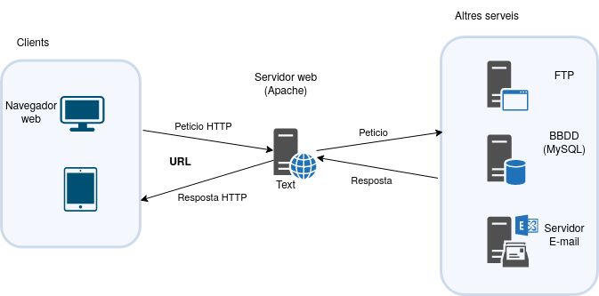
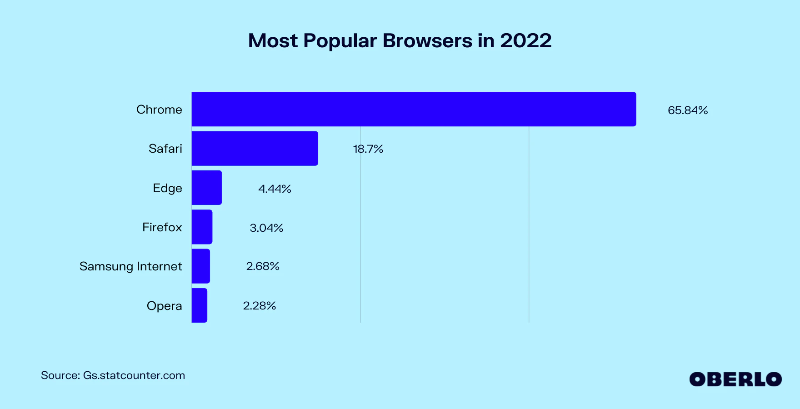
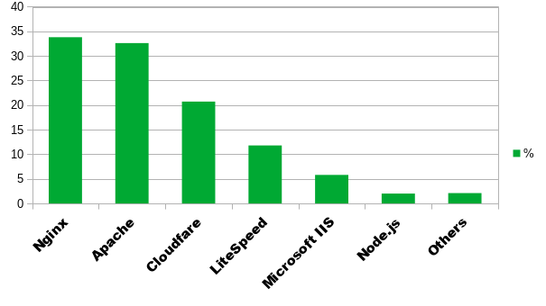
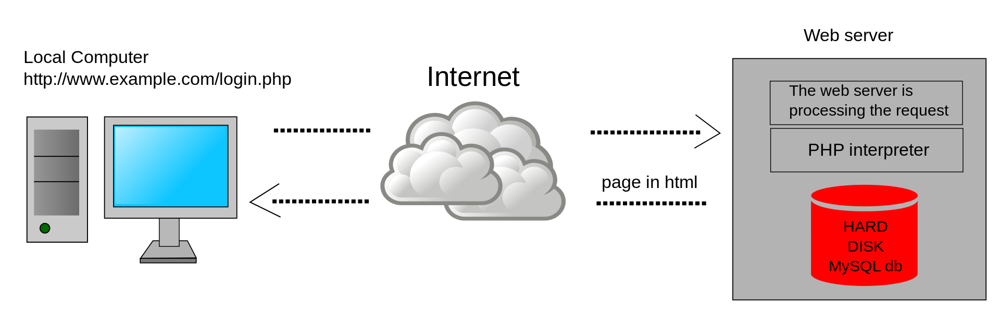

# Tema 9: PHP

## Índex de continguts

## 9.0 Introducció. Model de programació en entorn client/servidor. Llenguatges de programació en entorn servidor

En aquesta unitat veurem el llenguatge de programació PHP, que és pot insertar en el codi del llenguatge de marques HTML. Les pàgines web es poden accedir en local, és a dir podem obrir un arxiu html amb el nostre navegador i visualitzar-ho. No obstant, aquest no és l'escenari més comú. Les aplicacions web fan servir el model client/servidor que veurem a continuació. El funcionament d'aquesta arquitectura és el següent:



Els components d'aquesta arquitectura són:

### **Client**
Són dispositius que fan peticions des d'un **navegador** amb una interfície web al servidor. Fan servir el protocol HTTP que envia una resposta novament al client. Per fer les peticions web es fan servir les URL. Una **URL** és una adreça que conté les dades necessàries per localitzar un recurs en un servidor i que aquest li retorni la informació que necessita. Conté per exemple la IP o nom del del domini (per exemple google.com) per identificar l'equip a Internet, i la ruta dintre del servidor on localitzar el recurs que es demana.

A continuació podem veure quins són els navegadors més utilitzats:



[Usage share of web browsers (wikipedia)](https://en.wikipedia.org/wiki/Usage_share_of_web_browsers#Summary_tables)

El format d'una URL és el següent

`protocol://domini.tld:port/ruta_recurs/recurs`

Per exemple:

`http://ioc.xtec.cat:80/campus/login/index.php` 

* **Protocol**: El protocol que es farà servir per la comunicació client-servidor. Normalment serà http o https (HTTP segur), però poden ser altres.
* **Domini**: Nom DNS de l'equip on es troba servidor web. TLD o Top level domain és un domini de nivell superior (.com, .net, .org, etc.)
* **Port**: El port on el servidor Web està escoltant. Per defecte, si no s'especifica és el 80. Per connexió HTTPS és fa servir el 443.
* **Ruta** fins al recurs: correspon a la ruta fins a la carpeta dins del servidor web on es troba el recurs (campus/login/).
* **Recurs**: és el recurs o fitxer que demanem al servidor.

### **Servidor web**
Un servidor conté un servei (programa que està sempre en execució) que rep les peticions dels clients, localitza els recursos demanats i els retorna als clients. Els recursos demanats normalment es troben dins del mateix servidor web, per exemple, una pàgina html dins el directori arrel del servidor.


Font: [w3techs.com](https://w3techs.com/technologies/overview/web_server)

En aquest unitat farem servir el servidor web Apache. És un servidor web de codi obert llençat el 1995 i el més utilitzat durant molts anys. Apache té un disseny modular, de manera que pot ser ampliat amb altres funcionalitats que poden ser activades independentment del nucli. Darrerament Nginx s'ha popularitzat com a alternativa a Apache, creat pel enginyer rus Igor Sysoev el 2004.

### **Altres serveis**

A vegades un servidor pot demanar dades a un altre servidor. Per exemple, un servidor web pot demanar un llistat de productes a una base de dades per processar-lo abans d'enviar-lo al client.

## 9.1 Llenguatges de scripting

Breu història de la web.

**1990-1995**

La [primera pàgina web](http://info.cern.ch/hypertext/WWW/TheProject.html) és van crear al 1991. Els webs només contenien texte i enllaços, sense imatges o contingut multimèdia. Les webs eren completament estàtiques, és a dir no hi havia cap interacció més enllà dels enllaços per navegar a una altra pàgina. Sense animacions, popups, estils o contigut gràfic. 

En aquesta època van aparèixer els primers llocs web. Javascript és va crear el 1995. 

**1996-2000**

La primera versió de CSS (CSS1) es va introduïr el 1996. Fins aleshores tot l'estil s'implementava amb marques HTML (bgcolor, etc.). CSS permetia separar el contingut de l'estil. Les diferents pàgines podien compartir els CSS i tenir un disseny consistent.  

Les versions HTML2 (1995), HTML3 (1997) i HTML4 (1999) es van crear durant aquest període (HTML5 va arribar el 2014, 15 anys després).
PHP va sortir el 1995, així com altres llenguatges de servidor com ASP (1996) o JSP (1999).

**2000-2010**

Wikipedia, una de les webs més visitades, es va crear el 2001 i també fa servir tecnologia dinàmica al seu software MediaWiki.

Wordpress es va llençar el 2003, desenvolupat en el llenguatge PHP per entorns amb bases de dades com MySQL o PostgreSQL. A dia d'avui (2022), més del 40% de totes les pàgines d'internet fan servir Wordpress [Font: w3techs.com](https://w3techs.com/technologies/details/cm-wordpress).

**2010-2020**

En aquesta època surten els frameworks de Javascript més coneguts per desenvolupar webs: React (llibreria feta per programar Facebook) al 2013, Vue.JS (2014) i Angular (2010), desenvolupat per Google.

També es llença Node.js (2009) com a alternativa a PHP.

### Server-side scripting

Les pàgines web dinàmiques, a diferència de les webs estàtiques es generen sota demanda. El contingut d'una web dinàmica canvia segons l'hora del dia, l'usuari, etc. mentre que una web estàtica (per exemple una wiki o un blog) està pensada per a la publicació de continguts estàtics. 



A una pàgina web dinàmica, la petició arriba al servidor web. Aquest comprova si el contingut ha de ser generat dinàmicament i en aquest cas li passa la petició al processador de scripts de servidor (l'interpret PHP). Aquest genera el codi HTML dinàmicament i li retorna la pàgina web al servidor web, que la transmet al client.

Existeixen diversos llenguatges de scripting de servidor, essent PHP el més utilitzat i amb una comunitat més àmplia. PHP permet l'accés a recursos externs com bases de dades. 

**Python**

Utilitzat amb frameworks com Django o Flask. Python és fàcil d'aprendre i té més utilitats que PHP.

**Ruby**

El framework Ruby on Rails permet crear aplicacions seguint el model MVC (Model Vista Controlador).

**Node.js**

Node.js no és un llenguatge de programació, sino un entorn d'execució en el costat del servidor per executar Javascript. Conté el gestor de paquets NPM.


## 9.2 Programació bàsica amb PHP

PHP (acrònim recursiu PHP: Hypertext Preprocessor) és un llenguatge de script de servidor molt utilitzat en el desenvolupament web. Permet incrustar codi PHP dintre d'una pàgina HTML. Per exemple:

```html
<html>
  <head><title>Exemple</title></head>
  <body>
      <?php
        echo "Hola, sóc un script PHP!";
      ?>
  </body>
</html>
```

En aquest exemple el codi PHP està dintre de les etiquetes <?php i ?> i l'únic que fa es mostrar per pantalla el texte `Hola, sóc un script PHP!`. Aquest exemple és molt sencill i aquest texte el podem mostrar sense l'ús de PHP, però podria connectar-se a una base de dades MySQL i mostrar informació de les taules.

### 9.2.0 Comentaris

PHP permet diferents notacions per a la inserció de comentaris, dues provenen de C++ i l'altra de Perl o Bash.

Per tal de fer un comentari d'una sola linea podem utilitzar els símbols `//` o `#`. Per comentaris multilinea fem servir els símbols /* per indicar l'inici del comentari i */ per indicar el final. Un exemple:

```php
<?php
// això és un commentari d'una sola línea

# això també és un commentari d'una sola línea

/* comentari
multilinea */

?>
```

### 9.2.1 Constants

Una constant és un identificador per un valor que no canvia durant tota l'execució de l'script, excepte per a les constants màgiques que en realitat no són constants. Les constants són case-sensitive al igual que les variables. Per convenció les constants es defineixen en majúscules. 

Per definir constants a PHP, fem servir la funció define(). Exemples:

// Noms de constants vàlides
define("PI", "3.141592");
define("MAX_TEMP", "35");
define("MIN_TEMP", "-273.15");

// Noms de constants invàlides
define("2FOO", "algo");

Les constants màgiques es resolen en temps de compilació, per tant canvien durant l'execució de l'script. Cadascuna proporciona informació útil sobre l'entorn d'execucuió. Hi ha nou constants màgiques:

|Nom              | Descripció     |
|-----------------|----------------|
|`__LINE__`       | Linea actual de l'arxiu .php               |
|`__FILE__`       | Ruta completa i nom de l'arxiu php que s'està executant              |
|`__DIR__`        | Directori on està l'arxiu              |
|`__FUNCTION__`   | El nom de la funció actual              |
|`__CLASS__`      | El nom de la classe actual              |
|`__TRAIT__`      | El nom del tret actual (POO)              |
|`__METHOD__`     | El mètode de la classe actual               |
|`__NAMESPACE__`  | El nom de l'espai de noms actual              |
|ClassName::class | Nom fully-qualified (ruta completa) de la classe              |

### 9.2.2 Variables

Les variables a PHP comencen per el símbol dolar ($) seguides d'un identificador, que és el nom de la variable. Per exemple:

```php
$laMevaVariable = 1;
```
En l'exemple anterior, a la variable `$laMevaVariable` li assignem el valor `1`.

Les variables poden tenir qualsevol nom, només han de seguir unes regles senzilles:

* Una variable comença pel símbol `$`, seguit del nom de la variable.
* Han de començar per una lletra o el caracter subratllat `_`, no poden començar per un número.
* Només poden contenir caràcters alfanumérics (a-z,A-Z,0-9) i el caracter subratllat `_`.
* Són case-sensitive (`$numero` i `$Numero` són variables diferents).
* No hi ha una convenció per a les variables amb vàries paraules: alguns frameworks fan servir camelCase (`$laMevaVariable`) i altres el caracter subratllat (`$la_meva_variable`). Decidiu una convenció i feu-la servir al llarg dels vostres programes.

### 9.2.2.1 Tipatge de dades

PHP és un llenguatge no tipat (o débilment), al igual que Javascript i a diferència de Java. Això vol dir que no hem d'especificar un tipus de dades a l'hora de definir una variable. Podem assignar un valor enter a una variable i després assignar-li un valor en decimal (float).

```php
$laMevaVariable = 1;
$laMevaVariable = 1.5;
```

PHP internament fa la conversió de les variables d'un tipus a un altre. De totes formes és important conéixer els tipus de dades amb els que treballa internament. Són els següents (els que estan en negreta són els que veurem en aquest tema).


|Tipus de dades        | Categoria      | Descripció               |
|----------------------|----------------|--------------------------|
|**int**               | **Escalar**    | **Enter**                |
|**float**             | **Escalar**    | **Decimal**              |
|**bool**              | **Escalar**    | **Valor booleà**         |
|**string**            | **Escalar**    | **Cadena de caràcters**  |
|**array**             | **Compost**    | **Col.lecció de valors** |
|object                | Compost        | Tipus de dades definit per l'usuari |
|resource              | Especial       | Recurs extern            |
|callable              | Especial       | Funció o mètode          |
|mixed                 | Especial       | Qualsevol tipus          |
|**null**              | **Especial**   | **Cap valor**            |

**Enter**

Els números enters es podem especificar en diferents bases:

```php
  $myInt = 1234; // numero decimal (base 10)
  $myInt = 0b10; // numbero binari (2 en decimal)
  $myInt = 0123; // numero octal  (83 en decimal)
  $myInt = 0x1A; // numero hexadecimal (26 en decimal)
```
Els enters en PHP són sempre amb signe (podem emmagatzemar números negatius).

**Float**

Els números en coma flotant emmagatzemen números reals. És poden especificar amb notació decimal o exponencial:

```php
  $myFloat = 1.234;
  $myFloat = 3e2;   // 3*10^2 = 300
```

**Bool**

Les variables booleanes representen un valor booleà, que és un valor que només pot ser vertader o fals.

```php
  $myBool = true;
```

**Null**

Null s'utilitza per representar una variable sense valor.

```php
  $myNull = null; // variable establerta a null
```

A PHP 8, les variables s'han de definir (inicialitzar) abans d'usar-les, sino donarà error.

```php
  // PHP 8
  $myDefined = null;
  echo $myDefined;    // ok
  echo $myUndefined;  // error 
```

**String**

Un string o cadena és una sèrie de caràcters que s'emmagatzemen a una variable. Exemple:

```php
  $cadena = 'Hola';
```

Les cadenes tenen dos operadors: l'operador de concatenació `.` i l'operador concatenació més assignació `.=`. Exemple:

```php
  $cadena = 'Hola';
  $cadena = $cadena . 'mundo';

echo $cadena; // treu la cadena 'Hola mundo'

$hola = 'Hola';
$mon = ' mon';
$hola .= $mon;

echo $hola; // treu la cadena 'Hola mundo'
```

Les cadenes a PHP es poden delimitar de vàries formes, amb cometes simples ('') o cometes dobles (""). La diferència és que amb les cometes dobles les variables que aparèixen dintre es processen, mentre que amb cometes simples no.

Exemple:

```php
$mon = 'món';
echo "Hola $mon"; // "Hola món"
echo 'Hola $mon'; // "Hola $mon"
```

### 9.2.3 Tipus de dades compostes

Els arrays o vectors s'utilitzen per guardar una col.lecció de valors en una única variable. Els arrays a PHP consisteixen en una sèrie de parelles clau-valor. La clau pot ser:

**Enter (array numèric)**

Els arrays numèrics guarden cada element de l'array amb un índex numèric. Un array numèric es crea amb el constructor `array`. Per exemple:

```php
$array = array(1, 2, 3);
```

Alternativament, podem utilitzar claudàtors per inicialitzar l'array.

```php
$array = [1, 2, 3];
```

Per accedir a cadascuna de les posicions de l'array, comencem des de l'index 0 indicant l'índex dintre dels claudàtors. Per exemple:

```php
$array[0] = 1;
$array[1] = 2;
$array[2] = 3;
```

A diferència d'altres llenguatges com Java, el número d'elements d'un array és gestionat automàticament. Per tant, la següent instrucció seria correcta:

```php
$array = array(1, 2, 3);

$array[3] = 4; //array definit amb 3 posicions, però no dona error
```

També podem omitir l'index per afegir un nou element, PHP l'afegeix al final:

```php
$array = array(1, 2, 3);

$array[] = 4; // equivalent $array[3] = 4
```

**String (array associatiu)**

En aquest tipus d'array la clau es de tipus `String`. Exemple:

```php
$array = array('un' => 'a', 'dos' => 'b', 'tres' => 'c');
```

Els elements en un array associatiu es referencien fent servir el nom de l'element. No es poden referenciar amb un índex numèric.

```php
$b['un'] = 'a';
$b['dos'] = 'b';
$b['tres'] = 'c';

echo $b['un'] . $b['dos'] . $b['tres']; // "abc"
```

**Una combinació dels dos (mixed array)**

Podem combinar els dos tipus d'elements en un array, fent servir la notació fletxa (`=>`) per especificar els elements numèrics.

```php
$array = array(0 => 1, 'foo' => 'bar');
```

Hem d'accedir als elements fent servir les mateixes claus.

```php
echo $d[0] . $d['foo']; // "1bar"
```

### 9.2.4 Condicionals

Les sentencies condicionals ens permeten executar un bloc de codi -un conjunt d'instruccions- depenent d'una o vàries condicions. El següent bloc de codi dintre de les claus només s'executa si l'expressió que hi ha entre parèntesis s'evalua a vertadera.

```php
$x = 1;

if ($x == 1) {
  echo 'x és 1';
}
```

L'expressió `if` es completa amb `else` per comprovar altres condicions.

```php
if ($x == 1)
  echo 'x és 1';
elseif ($x == 2)
  echo 'x és 2';
else
  echo 'x és una altra cosa (diferent de 1 i de 2)';
```

Les claus són opcionals sempre que hi hagi només una instrucció dintre del bloc. 

### 9.2.4 Bucles

Hi ha quatre estructures de bucles a PHP. Aquestes estructures repeteixen una sèrie d'instruccions mentre es compleixi una o vàries condicions.

**While**

El codi dintre de les claus es repeteix fins que la condició s'evalua falsa. És possible que el bloc d'instruccions no s'avalui cap vegada.

Exemple:

```php
  $i = 0;

  while ($i < 10) { 
    echo $i++; // Imprimeix els numeros del 0 al 9 
  } 
```

**Do-While**

El codi dintre de les claus es repeteix fins que la condició s'evalua falsa. Él bloc d'instruccions s'avalua com a mínim una vegada i la condició s'avalua al final.

Exemple:

```php
  $i = 0;

  do { 
    echo $i++; // Imprimeix els numeros del 0 al 9 
  } while ($i < 10); 
```

**For**

El bloc de codi s'executa un número definit de vegades. El **primer paràmetre** inicialitza la variable associada al bucle, normalment un contador. 

El **segon paràmetre** indica el número de vegades que s'executarà el bloc de codi.

El **tercer paràmetre** incrementa el contador i s'executa després del bloc de codi.

Exemple:

```php
  for ($i = 0; $i < 10; $i++) { 
    echo $i; // Imprimeix els numeros del 0 al 9 
  } 
```

**Foreach**

L'estructura foreach proporciona una forma fàcil per iterar arrays.

Exemple:
```php
  $array = array(1,2,3);

  foreach ($array as $element) {
    echo $element; // Imprimeix "123"
  }
```

Per iterar sobre arrays associatius, foreach proporciona un métode per obtenir tant els noms de les claus com dels valors. Exemple:

```php
  $array = array('one' => 1, 'two' => 2);

  foreach ($array as $clau => $valor) {
    echo "$clau = $valor "; // Imprimeix "one = 1 two = 2 "
  }
```

### 9.2.5 Funcions

Les funcions són blocs de codi que només s'executen quan es criden. La creació de funcions està dividida en dues parts:

* Es **defineix la funció**. Permet definir els paràmetres d'entrada (és a dir les dades que se li passen quan les cridem), els valor de retorn (el valor que la funció calcula i retorna al programa principal) i les instruccions que conformen el bloc de codi i realitzen una tasca definida. Les funcions es creen amb la paraula clau `function`:

  ```php
  function suma_enters($a, $b) {
    return $a + $b;
  }
  ```

  Algunes consideracions:
  * Els nom de les funcions es **case-insensitive**. És a dir suma_enters, Suma_Enters i SUMA_ENTERS són la mateixa funció.
  * Els paramètres formals (els que surten a la definició) no tenen tipus.
  * Podem assignar valors per defecte, per exemple:

    ```php
    function suma_enters($a, $b = 3) {
      return $a + $b;
    }
    ```
  * El paràmetre de retorn `return` és opcional. En aquest cas, la funció retorna el valor `null`. 

* Es **crida a la funció**. Des d'altra part del programa, es crida a la funció, el que fa es executar el bloc de codi de la funció amb els paràmetres reals.

  ```php
    $suma = suma_enters(3, 4) //suma val 7
  ```

  Si la funció té parámetres opcionals, el nombre de paràmetres a la trucada pot variar. En l'exemple anterior, podriem fer:

  ```php
    $suma = suma_enters(3) // $a = 3 $b = 3 -> suma val 6
  ```

## 9.3. Recuperació i processament de dades des d'un formulari web

Fins ara hem vist les caracterìstiques del llenguatge PHP equivalents a qualsevol altre llenguatge de programació de propòsit general (com Java o Python). Encara que podem utilitzar PHP des de la línea de comandes amb l'ordre `php arxiu.php`, en general tant l'entrada de dades com la sortida la farem mitjançant HTML. Per a recollir dades de l'usuari, farem servir els formularis HTML. Quan un formulari s'envia a una pàgina PHP, les dades enviades estan disponibles per aquell script PHP.

Tenim el següent formulari HTML:

```html
  <?php // myform.php ?>
  <!doctype html>
  <html>
    <body>
      <form action="mypage.php" method="post">
        <input type="text" name="myString">
        <input type="submit">
      </form>
    </body>
  </html>
```
L'element HTML form té dos atributs obligatoris:

* **action**: especifica l'script PHP que s'executarà quan el formulari s'enviï.
* **method**: especifica el mètode per enviar la informació. El mètode pot ser GET o POST. 

A continuació veurem l'script `mypage.php` amb cadascun dels dos mètodes.

**POST**

Amb aquest mètode, les dades estan disponibles en l'array `$_POST`. Aquesta variable està predefinida al nostre sistema i es un array **superglobal** que veurem a continuació. El valor de l'atribut `name` de l'element `input` del formulari es converteix en una clau d'aquest array.

```html
  <?php // mypage.php ?>
  <!doctype html>
  <html>
    <body>
      <?php echo $_POST['myString']; ?>
    </body>
  </html>
```

Amb el mètode post, les dades enviades des del formulari **no** són visibles a la URL de la pàgina, tal com sí passa amb el mètode **GET**. 

**GET**

Amb aquest mètode, les dades estan disponibles a l'array `$_GET`.  

```html
  <?php // mypage.php ?>
  <!doctype html>
  <html>
    <body>
      <?php echo $_GET['myString']; ?>
    </body>
  </html>
```

Una petició GET codifica els paràmetres del formulari a la URL en el que s'anomena la cadena de búsqueda. La cadena de búsqueda és tot el que surt després de l'interrogant (?). En l'exemple que vé, seria `myString=Foo+Bar`.

Aquest métode permet passar variables entre pàgines, per exemple amb enllaços HTML. Suposem el següent exemple, on enviem una cadena de texte entre dos pàgines web.

```html
  <?php // sender.php ?>
  <!doctype html>
  <html>
    <body>
      <a href="receiver.php?myString=Foo+Bar">link</a>  
    </body>
  </html>
```

Quan fem click en l'enllaç, l'script `receiver.php` pot accedir a les dades que li han passat:

```html
  <?php // receiver.php ?>
  <!doctype html>
  <html>
    <body>
      <?php echo $_GET['myString']; // Imprimeix "Foo Bar" ?>
      <a href="sender.php">Retorna a sender.php</a> 
    </body>
  </html>
```
### **9.3.1. Funcions per testejar existència/valor**

Hi ha una sèrie de funcions molt utilitzades per comprobar l'entrada proporcionada per l'usuari. Les variables s'han de comprobar abans d'utilitzar-les.

**Isset**
`isset($nom_variable)` retorna true si la variable existeix i se li ha assignat un valor diferent de null.

```php
  isset($a); // false
  $a = 10;
  isset($a); // true
  $a = null;
  isset($a); // false
```
**Empty**
`empty($nom_variable)` retorna true si la variable està buida (té valor null, 0, false o cadena buida) o no existeix. 

```php
  empty($b); // true
  $b = false;
  empty($b); // true
```

**Is_null**
`is_null($nom_variable)` retorna true si la variable està establerta a null. A partir de PHP8, is_null retorna TypeError si la variable no e

```php
  $c = null;
  is_null($c); // true
  $c = 10;
  is_null($c); // false
  is_null($d); // Type error
```

**unset**
Una altra funcio útil es `unset($nom_variable)`, que esborra el valor de la variable de l'àmbit actual. Una funció o una pàgina defineix un àmbit on les variables només són vàlides en el seu àmbit.

```php
$e = 10;
unset($e); // esborrar $e
```

### **9.3.2. Arrays superglobals**

  Com hem vist, hi ha una sèrie d'arrays associatius disponibles als nostres scripts PHP. Aquests arrays es coneixen com superglobals, perquè estan disponibles en qualsevol pàgina web i àmbit. Hi ha nou variables superglobals, algunes de les quals veurem en el capítol posterior.

  | Nom       | Conté                                                        |
  |-----------|--------------------------------------------------------------|
  |$GLOBALS   | Totes les variables globals, incloent les superglobals       |
  |$_GET      | Les variables enviades amb una petició HTTP GET              |
  |$_POST     | Les variables enviades amb una petició HTTP POST             |
  |$_FILES    | Les variables enviades amb una petició HTTP POST pujada arxiu |
  |$_COOKIE   | Les variables enviades amb galetes HTTP (següent capítol)    |
  |$_SESSION  | Les variables guardades a una sessió d'usuari (següent capítol) |
  |$_REQUEST  | Les variables $_GET, $_POST i possiblement $_COOKIE          |
  |$_SERVER   | Informació sobre el servidor web i les peticions fetes a ell |
  |$_ENV      | Totes les variables d'entorn guardades pel servidor          |

  Els valors de $_GET, $_POST, $_COOKIE, $_SERVER i $_ENV es poden veure a la sortida generada per la funció de PHP phpinfo(). Aquesta funció també mostra els ajustaments generals de l'arxiu php.ini així com altra informació relacionada amb PHP (extensions habilitades, informació sobre el servidor, etc.).

### **9.3.3. Informació del servidor**

L'array `$_SERVER` conté un munt d'informació útil sobre el servidor web. A continuació tenim una llista completa:

| Nom               | Descripció                                                            | Exemple
|-----------        |-----------------------------------------------------------------------|----------------------------------------------|
|PHP_SELF           | Conté el nom de l'script actual,                                      | `/magatzem/carret_compra.php`                |
|SERVER_SOFTWARE    | Una cadena que identifica el servidor                                 | `Apache/1.3.33 (Unix) mod_perl/1.26 PHP/8.1` |
|SERVER_NAME        | El nombre de host, alias DNS o adreça IP del servidor web.            | `www.exemple.com`                             |
|GATEWAY_INTERFACE  | La versió de l'estàndar CGI que es segueix                            | `CGI/1.1`                                     |
|SERVER_PROTOCOL    | Nom i revisió del protocol HTTP                                       | `HTTP/1.1`                                    |
|SERVER_PORT        | El número de port a on la petició HTTP s'ha enviat                    | `80`                                          |
|REQUEST_METHOD     | El mètode utilitzar per obtenir el document                           | `GET`                                         |
|PATH_INFO          | Elements extra enviats a la URL                                       | `/list/users`                                 |
|PATH_TRANSLATED    | El valor de PATH_INFO, traduït a una ruta del servidor p. ex          | `/home/httpd/htdocs/list/users`               |
|SCRIPT_NAME        | la ruta URL a la pagina actual, útil per scripts autoreferenciables.  | `/~me/menu.php`                               |
|QUERY_STRING       | Tot el que hi va després de ? a la URL                                | `nom=Quim+edat=35`                            |
|REMOTE_HOST        | El nom de l'equip de la màquina que ha demanat la pàgina              | `host1.exemple.com`                           |
|REMOTE_ADDR        | Una cadena que conté l'adreça IP de la màquina que fa la petició.     | `192.168.0.250`                               |
|AUTH_TYPE          | Tipus d'autenticació per protegir la pàgina, si aquesta està protegida| `basic`                                       |
|REMOTE_USER        | Usuari amb el que el client s'ha autenticat,                          | `Quim`                                        |

### **9.3.4. Pàgines autoprocessades**

Podem crear una pàgina PHP que generi un formulari i després el processi. Una forma de saber si mostrar el formulari és comprobar si algun dels paràmetres del formulari existeix. El següent exemple mostra un formulari que calcula el IMC (Index de Massa Corporal) i envia les dades amb mètode GET. Utilitza la presència de paràmetes per determinar què fer.

```php
<html>
  <head> <title>Càlcul IMC</title> </head>
  <body>
    <?php
      if (isset ( $_GET ['pes'] ) && isset ( $_GET ['alcada'] )) {
        $pes = $_GET ['pes'];
        $alcada = $_GET ['alcada'];
      } else {
        $pes = null;
        $alcada = null;
      }
      if (is_null($pes) || is_null($alcada)) {
        ?>
        <form action="<?php echo $_SERVER['PHP_SELF']; ?>" method="GET">
          <label for="name">Pes (kg): </label>      <input type="text" id="pes" name="pes" /><br />
          <label for="alcada">Alçada (m): </label>  <input type="text" id="alcada" name="alcada" /><br />
          <input type="submit" value="Calcula el meu IMC!" />
        </form>
      <?php
      } else {
        $imc = $pes / ($alcada*$alcada);
        printf ( "L'IMC és %.2f", $imc );
      }
    ?>
  </body>
</html>
```

### **9.3.5. Càrrega de fitxers**

## 9.4 Funcionalits web

### 9.4.1 Sessions

Una sessió és el període que hi ha entre que obrim una aplicació i la tanquem. Normalment obrim l'aplicació, treballem amb ella, fem canvis, i després la tanquem. Durant aquest període l'aplicació sap qui som, quan obrim l'aplicació i quan la tamquem (per exemple, quan iniciem sessió a Windows o a Linux). A internet hi ha un problema doncs el protocol no manté l'estat.

HTTP és un protocol stateless (no manté l'estat). Això vol dir que cada petició que es fa al servidor web és independent de les anteriors. És a dir cada petició es una parella de petició resposta independent de les altres. Aixó es contraposa a altres protocols d'internet com FTP. Amb FTP establim una sessió on l'usuari defineix una sèrie de paràmetres que són valid per a tota la sessió (directori de treball, mode de transferència, etc). 

Per solventar aquest problema, el servidor web ens proporciona les variables de sessió. PHP té suport incorporat per a les sessions. Per crear una sessió a PHP, fem servir la funció `session_start()`. Aquesta funció s'ha d'executar abans de treure cap sortida per pantalla (per exemple amb `echo`). Una vegada hem creat la sessió, podem guardar dades com el nom d'usuari o el número de visites amb l'array superglobal $_SESSION[].

index.php
```php
  <?php 
  session_start();

  //guardem l'usuari de la sessió. Aquest usuari pot venir d'una BBDD
  $_SESSION['user'] = 'admin';
  ?>
  <html>
    <head>
        <title>PHP Session Demo</title>
    </head>
    <body>
        <a href="perfil.php">Anar al perfil</a>
    </body>
  </html>
```

perfil.php
```php
  <?php 
  session_start();

  if (isset($_SESSION['user'])) {
      echo "<p>Benvingut <strong>" . $_SESSION['user'] . "</strong></p>";
  }

  //La caducitat d'una sessió ve definida a session.cache_expire a l'arxiu php.ini
  $caducitat = session_cache_expire();
  echo "<p>Caducitat de la sesió: $caducitat minuts.</p>";

  //Algunes dades de la sessió
  echo "<p>SID de la sessio: " session_id() . "</p>";              //SID de la sessió
  echo "<p>Nom de la sessio: " session_name() . "</p>";            //Nom de la sessió
  echo "<p><a href=\"index.php\">Retornar a l'index</a></p>";
  echo "<p><a href=\"logout.php\">Sortid de la sessió</a></p>";
  ?>
```
Per sortir de la sessió, hem de crear una altra pàgina amb la funció `session_destroy()`:

logout.php
```php
  <?php  
  session_start();                //ens assegurem que usem la mateixa sessió
  session_destroy();              //destruir la sessió
  header("location:perfil.php"); //redirecció a "perfil.php" després de logout.
  exit();
  ?>
```

### 9.4.2 Galetes (cookies)

Una galeta és un petit arxiu de texte que envia el servidor web i guardem al nostre equip amb informació sobre les preferències del usuari. Permeten guardar dades com l'idioma, nom de l'usuari, colors del navegador. Les galetes tenen algunes resticcions:

* No poden ocupar més de 4Kb.
* Els servidors només poden accedir a les cookies establertes pel seu domini.
* Hi ha un límit de cookies per domini i un limit total de cookies a l'equip de client.
* Tenen una data de caducitat, a partir de la qual s'esborren.

Per crear una cookie fem servir la funció setcookie(). Només té dos paràmetres obligatoris, `name` i `value`. Les cookies s'han d'enviar abans de qualsevol altre output a la pàgina (per exemple amb `echo`).

Sintaxi:

```php
 setcookie(
    string $name,
    string $value = "",
    int $expires = 0,
    string $path = "",
    string $domain = "",
    bool $secure = false,
    bool $httponly = false
): bool
```
Paràmetres:

* Name: el nom de la cookie, per exemple `usuari`.
* Value: Valor de la cookie, per exemple `joan`. Per recuperar aquest valor, utilitzariem $_COOKIE['usuari'].
* expires: temps en el que la cookie expira en segons.
* path: ruta dintre del servidor on es guardarà la cookie. Si es fa servir `/` la cookie estarà disponible per a tot el domini.
* domain: subdomini per al qual la cookie estarà disponible.
* secure: la cookie només s'envia si el protocol es HTTPS.
* httponly: la cookie només serà accesible amb el protocol HTTP.

Exemple:

```php
  <?php
  $valor = "valor de la cookie";
  setcookie("cookie_proves", $valor);

  echo "el valor de la cookie és " . $_COOKIE['cookie_proves'] . ".";
  ?>
```

## Annex 1. Instal.lació entorn de desenvolupament

Per a crear el nostre entorn de desenvolupament, necessitarem principalment dues eines.

* **Servidor web** (Apache2) que enviarà peticions a PHP per crear pàgines dinàmiques.
* El **llenguatge de programació PHP** incrustat en pàgines HTML.

Per a instal.lar aquest programari, ho podem fer individualment en cadascuna de les nostres màquines, però és molt probable que cadascun tingui un sistema operatiu diferent, software o configuracions que afectin al funcionament del servidor. Per tal de crear un entorn de programació homogeni, tenint en compte que Apache es fa servir típicament a Linux, utilitzarem màquines virtuals.

Per tal de crear aquest entorn, utilitzarem la tècnica de virtualització amb Virtualbox, que ens permet instal.lar un S.O. virtual sobre el nostre hardware. Per automatitzar la instal.lació les màquines virtuals (MV) utilitzarem Vagrant. **Vagrant** permet automatitzar la instal.lació i configuracio de màquines vituals.

Per tant, els passos aseguir per a tenir el nostre entorn de desenvolupament serien:

* Descarregar [VirtualBox](https://www.virtualbox.org/wiki/Downloads "VirtualBox Downloads") e instal.lar-ho. Si l'instal.lem a Windows, és possible que ens demani instal.lar també les llibreries de Visual C++. Hem d'instal.lar-les abans d'instal.lar Virtualbox.

* Descarregar [Vagrant](https://developer.hashicorp.com/vagrant/downloads) e instal.lar-ho.

* Vagrant és una eina de linea de comandes. Per confirmar que la tenim instal.lada, obrim la linea de comandes (**CMD** a Windows o **Terminal** a Linux) i escrivim **vagrant -v**. Ens hauria de sortir algo així:

  ```bash
  $ vagrant -v
  Vagrant 2.3.4
  ```
* Per començar a utilitzar la nostra MV amb Linux + Apache2 (servidor web) + PHP, farem un desplegament automàtic. Per tal de començar, crearem un directori on emmagatzemarem la nostra configuració vagrant.

  ```bash
  $ mkdir vagrant
  $ cd vagrant
  ```
* Una vegada dintre del directori, hem de crear dos arxius de texte i un directori:
    * **Vagrantfile**. Aquest arxiu conté la configuració de la nostra màquina virtual (nom de la màquina, RAM reservada, IP del nostre servidor, etc.).
    * **bootstrap.sh**. Aquest arxiu conté l'aprovisionament de la màquina virtual, és a dir la configuració necessària per instal.lar el servidor web i PHP. Aquest script s'executa des de l'arxiu Vagrantfile.
    * **html**. En aquest directori guardarem les nostres pàgines web amb PHP. Si no el creem la MV no arrencarà.

* El contingut de l'arxiu **Vagrantfile**:

  ```v
  Vagrant.configure("2") do |config|
    config.vm.box = "debian/bullseye64"
    config.vm.hostname = "apache2php-server"
    config.vm.synced_folder "html/", "/var/www/html"
    config.vm.network "private_network", ip: "192.168.56.10"
    config.vm.network "forwarded_port", guest: 80, host: 80
    config.vm.provision "shell", path: "bootstrap.sh"

    config.vm.provider "virtualbox" do |v|
      v.name = "apache2php-server"
      v.memory = "1024"
      v.cpus = 1
    end
  end
  ```

Aquí podem veure tota la informació sobre la nostra MV: v.memory (RAM), config.vm.network (tipus de xarxa i IP), etc. És pot canviar algun paràmetre si la MV no funcionés bé però recomanem mantenir-los.

* El contingut de l'arxiu **bootstrap.sh**:

  ```bash
  #!/usr/bin/env bash

  apt update
  apt install apache2 -y

  # Install php8 on Debian official https://packages.sury.org/php/README.txt
  apt install apt-transport-https lsb-release ca-certificates curl -y
  curl -sSLo /usr/share/keyrings/deb.sury.org-php.gpg https://packages.sury.org/php/apt.gpg
  sh -c 'echo "deb [signed-by=/usr/share/keyrings/deb.sury.org-php.gpg] https://packages.sury.org/php/ $(lsb_release -sc) main" > /etc/apt/sources.list.d/php.list'
  apt update && apt upgrade

  # Versió actual i suportada PHP 8.1 fins finals 2024
  apt install php8.1 -y

  # Extensions PHP (no obligatòries)
  apt install php8.1-{cli,common,xml,curl,mbstring,zip,bz2} -y
  ```

* Guardem els dos arxius i executem la comanda per arrencar la nostra MV:

  ```
  vagrant up 
  ```

* A continuació fa un procés que processa els dos fitxers que acabem de crear. Concretament:

    * Descarrega la imatge del S.O. que li hem indicat des de els repositoris de vagrant. En el nostre cas Debian 11. Si ja la ha descarregada prèviament no la torna a descarregar i comença a muntar la MV.
    * Crea la MV amb els paràmetres que li hem indicat, habilita la xarxa a la MV per poder conectar-nos i comparteix les carpetes de la MV amb el nostre equip perquè podem treballar remotament i la nostra informació no es perdi
    * Aprovisiona la MV, és a dir instal.la el software necessari per començar a programar amb PHP. Aquesta part només la fa la primera vegada.

* A partir d'aqui ja tenim l'entorn preparat i podriem obrir **Visual Studio Code** per desenvolupar els nostres scripts amb PHP. Una vegada hem acabat de programar, el procediment seria el següent.

  ```
  vagrant halt
  ```

  Aquesta comanda para la màquina virtual, per torna a començar, hem d'accedir al directori que hem creat (on tenim Vagrantfile) i tornar a executar ```vagrant up```.

**Altres comandes**

Si en algun moment la nostra MV deixés de funcionar correctament, podem executar ```vagrant destroy```. Aquesta comanda esborra la MV i la seva definició a Virtualbox, però els nostres arxius estaran guardats al directori html. A continuació tornariem a fer ```vagrant up```.

Per conectar-nos a la MV, des de el directori on és Vagrantfile, executem ```vagrant ssh```. Allà podrem comprovar si els nostres serveis estan funcionant correctament o realitzar qualsevol modificació a la MV.

Finalment, per comprovar que tot ha anat correctament, hauriem de crear un arxiu html de prova (Hello World) i anar a la adreça http://192.168.56.10 al nostre navegador.